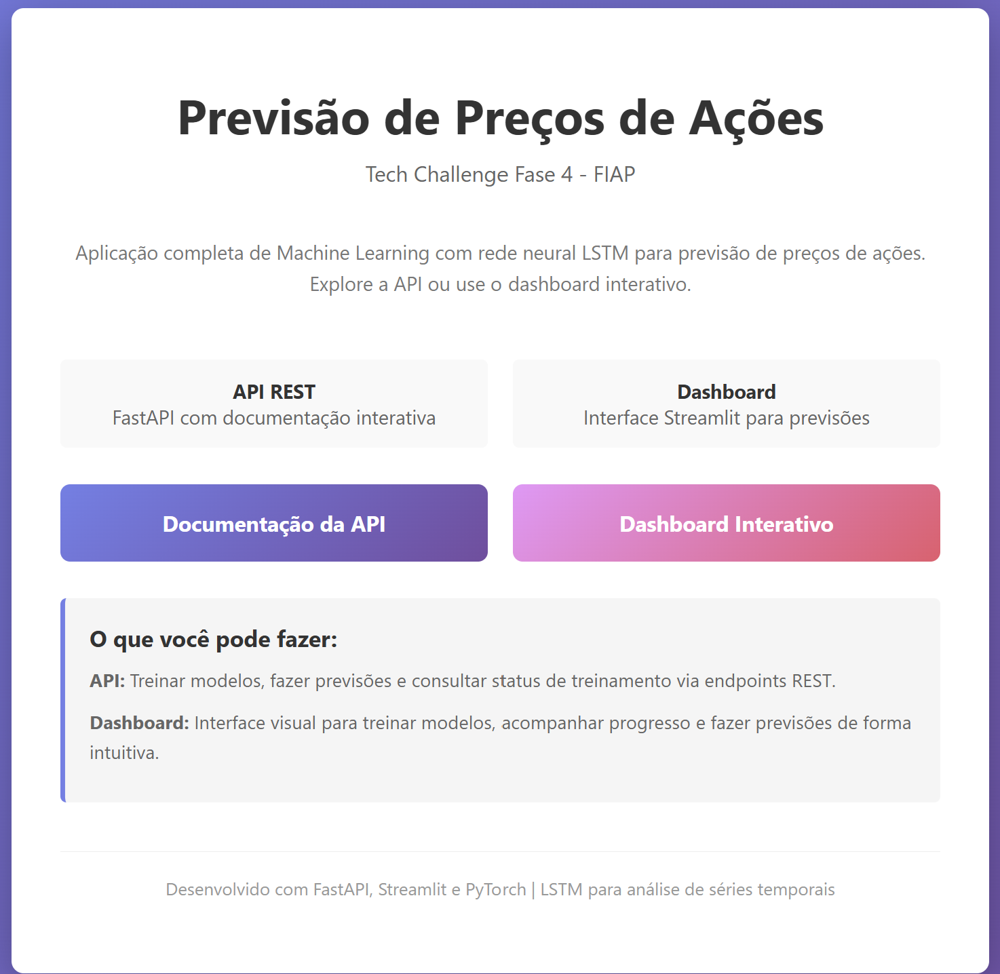
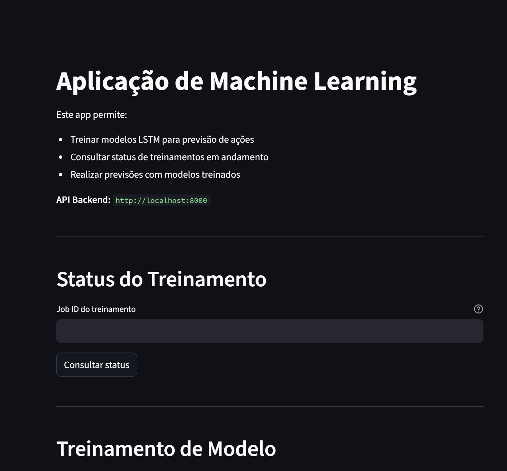
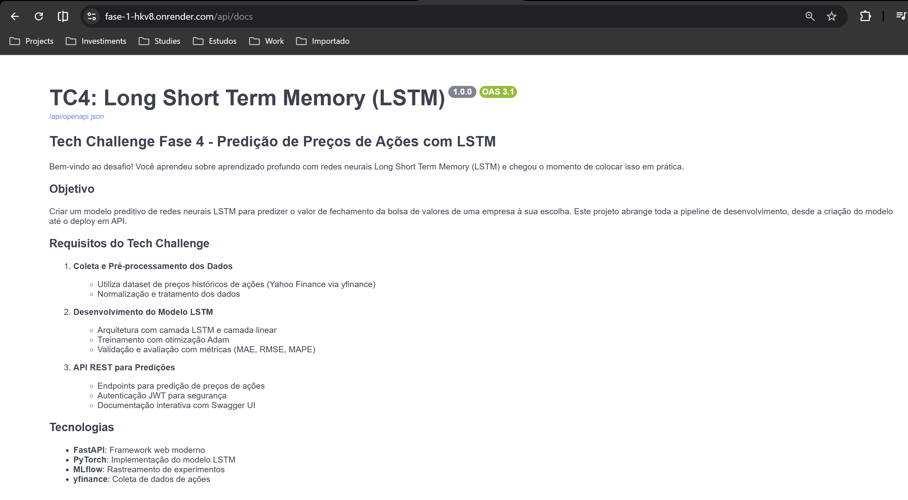

# Projeto Tech Challenge Fase 4
---
## 📌 Índice

- [📝 Sobre o Projeto](#-sobre-o-projeto)
- [🛠 Tecnologias e Ferramentas](#-tecnologias-e-ferramentas)
- [🧱 Arquitetura da Solução](#-arquitetura-da-solução)
- [🗂️ Estrutura de Diretórios](#-estrutura-de-diretórios)
- [🚀 Como Configurar e Executar o Projeto](#-como-configurar-e-executar-o-projeto)
- [✅ Testes e Validações](#-testes-e-validações)
- [🔄 CI/CD Pipeline](#-cicd-pipeline)
- [🤖 IA para Code Review](#-ia-para-code-review)
- [📖 Documentação da API](#-documentação-da-api)
- [📊 Monitoramento e MLflow](#-monitoramento-e-mlflow)
- [🎥 Vídeo Demonstrativo](#-vídeo-demonstrativo)
- [🤝 Desenvolvedores](#-desenvolvedores)
- [⚖️ Licença](#-licença)

---

## 📝 Sobre o Projeto

Este repositório contém a implementação do **Tech Challenge Fase 4 da Pós-Graduação em Machine Learning**, focado na construção de um sistema completo de previsão de preços de ações utilizando **Deep Learning**. O projeto implementa uma rede neural **LSTM (Long Short-Term Memory)**, eficaz para dados sequenciais, para capturar padrões temporais do mercado de ações e prever preços de fechamento.

### ✨ Funcionalidades Principais

- **Previsão de Preços**: Utiliza LSTM para prever o próximo preço de fechamento com base nos últimos 60 dias.
- **API REST Completa**: Endpoints para previsão, treinamento e verificação de saúde da aplicação.
- **Pipeline de Treinamento**: Sistema automatizado de treinamento com validação e salvamento de modelos.
- **Monitoramento com MLflow**: Rastreamento completo de experimentos, parâmetros e métricas.
- **Containerização**: Deploy simplificado via Docker e Docker Compose.
- **CI/CD Automatizado**: Pipeline completo de integração e entrega contínua com GitHub Actions.
- **Cobertura de Testes**: >90% de cobertura de código com testes automatizados.
- **IA para Code Review**: Revisão automática de código usando GitHub Copilot.

---

## 🛠 Tecnologias e Ferramentas

| Ferramenta | Categoria | Utilização no Projeto |
|------------|-----------|----------------------|
| 🐍 Python 3.11 | Linguagem de Programação | Linguagem principal para ML, API e pipeline de dados |
| 🔥 PyTorch | Framework de Deep Learning | Implementação da rede neural LSTM |
| ⚡ FastAPI | Framework Web | API REST de alta performance para servir o modelo |
| 📊 NumPy & Pandas | Bibliotecas de Dados | Manipulação e processamento de dados |
| 📈 yfinance | Biblioteca de Dados Financeiros | Extração de dados históricos de ações |
| 🧪 Pytest | Framework de Testes | Testes automatizados com >90% de cobertura |
| 📦 scikit-learn | Biblioteca de ML | Pré-processamento e normalização de dados |
| 🔍 MLflow | Plataforma MLOps | Rastreamento de experimentos e modelos |
| 🐳 Docker | Containerização | Ambiente isolado e reprodutível |
| 🔄 GitHub Actions | CI/CD | Pipeline automatizado de build, teste e deploy |
| 🤖 GitHub Copilot | IA Code Review | Revisão automática de código seguindo padrões |

---

## 🧱 Arquitetura da Solução

O sistema é construído sobre uma arquitetura modular e escalável com suporte para deployment em produção via Docker e Nginx.

### Arquitetura em Desenvolvimento

```
┌─────────────────┐     ┌──────────────────┐     ┌─────────────────┐
│   Yahoo Finance │────▶│  Data Pipeline   │────▶│  Preprocessing  │
│   (yfinance)    │     │  (data_loader)   │     │  (normalização) │
└─────────────────┘     └──────────────────┘     └─────────────────┘
                                                            │
                                                            ▼
┌─────────────────┐     ┌──────────────────┐     ┌─────────────────┐
│   Streamlit     │◀────│  LSTM Model      │◀────│  Feature Eng.   │
│   :8501         │     │  (PyTorch)       │     │  (sequences)    │
└─────────────────┘     └──────────────────┘     └─────────────────┘
         │                        │
         └────────▶ FastAPI ◀────┘
                    :8000
                      │
         ┌────────────┴────────────┐
         ▼                         ▼
┌─────────────────┐     ┌──────────────────┐
│   Docker        │     │    MLflow        │
│   (Deploy)      │     │  (Monitoring)    │
└─────────────────┘     └──────────────────┘
```

### Arquitetura em Produção (Render) — Apenas API

```
        https://fase-1-hkv8.onrender.com
          │
          ▼
        ┌──────────────────┐
        │  NGINX (Port 80) │
        │  Reverse Proxy   │
        └──────────────────┘
          │
         ┌────────────┴────────────┐
         ▼                         ▼
       / (opcional)                /api/*
     ┌──────────┐                 ┌──────────┐
     │index.html│                 │ FastAPI  │
     │Landing   │                 │ :8000    │
     └──────────┘                 └──────────┘
                │
                ▼
           ┌──────────────────┐
           │  LSTM PyTorch    │
           │  Model + Scaler  │
           └──────────────────┘
```

**Fluxo de Produção:**
1. Cliente acessa `https://fase-1-hkv8.onrender.com/`
2. Nginx serve landing (opcional) ou redireciona para `/api/docs`
3. Requisições para `/api/*` vão para FastAPI (:8000)
4. O dashboard Streamlit **não é servido em produção**; execute localmente apontando para a API

### Componentes Principais

1. **Camada de Dados**: Recuperação automática de dados históricos do Yahoo Finance via `yfinance`.
2. **Camada de Processamento**: Normalização (MinMaxScaler) e criação de sequências temporais de 60 dias.
3. **Camada de Modelo**: Rede neural LSTM de 2 camadas com 50 unidades ocultas implementada em PyTorch.
4. **Camada de Serviço**: API REST com FastAPI expondo endpoints de previsão, treinamento e saúde.
5. **Camada de Interface**: Dashboard Streamlit para interação visual com a API.
6. **Camada de Proxy**: Nginx como reverse proxy unificando acesso (produção).
7. **Camada de Monitoramento**: MLflow para rastreamento de experimentos, métricas e artefatos.
8. **Infraestrutura**: Ambiente dockerizado para deploys reprodutíveis e escaláveis.

---

## 🗂️ Estrutura de Diretórios

O projeto está organizado da seguinte forma para facilitar a navegação e o entendimento:

```
fase-4/
│
├── .github/
│   ├── copilot-instructions.md      # Instruções para IA Code Review
│   └── workflows/
│       └── ci-cd-pipeline.yml       # Pipeline de CI/CD automatizado
│
├── app/
│   ├── config.py                    # Configurações da aplicação
│   ├── main.py                      # Ponto de entrada da API FastAPI
│   ├── schemas.py                   # Schemas Pydantic (Request/Response)
│   ├── data/
│   │   └── __init__.py
│   ├── models/
│   │   └── __init__.py
│   ├── routes/
│   │   ├── __init__.py
│   │   ├── audit_route.py           # Rotas de auditoria
│   │   ├── predict_route.py         # Rota de previsão (Deep Learning)
│   │   └── train_route.py           # Rota de treinamento e status
│   └── utils/
│
├── src/
│   ├── data_loader.py               # Carregamento de dados do Yahoo Finance
│   ├── preprocessing.py             # Pré-processamento e normalização
│   ├── feature_engineering.py       # Engenharia de features (sequências)
│   ├── lstm_model.py                # Definição da Rede Neural LSTM
│   ├── train.py                     # Pipeline de treinamento do modelo
│   ├── evaluate.py                  # Avaliação e métricas do modelo
│   ├── seed_manager.py              # Gerenciamento de seeds para reprodutibilidade
│   └── utils.py                     # Funções auxiliares (save/load modelo)
│
├── tests/
│   ├── conftest.py                  # Configurações e fixtures do pytest
│   ├── test_lstm_model.py           # Testes do modelo LSTM (100% cobertura)
│   ├── test_utils.py                # Testes de utils (100% cobertura)
│   ├── test_evaluate.py             # Testes de avaliação (100% cobertura)
│   ├── test_preprocessing.py        # Testes de pré-processamento
│   ├── test_data_loader.py          # Testes de carregamento de dados
│   ├── test_config.py               # Testes de configuração
│   ├── test_main.py                 # Testes da API
│   ├── test_lifespan.py             # Testes de ciclo de vida da aplicação
│   ├── test_audit_route.py          # Testes de rotas de auditoria
│   ├── test_reproducibility.py      # Testes de reprodutibilidade
│   ├── test_train_integration.py    # Testes de integração (Treino/Predição)
│   ├── test_train_route_coverage.py # Testes de cobertura da rota de treino
│   └── test_train_unit.py           # Testes unitários de treinamento
│
├── notebooks/                       # Notebooks Jupyter para exploração
│
├── docker-compose.yml               # Orquestração de contêineres
├── Dockerfile                       # Definição da imagem Docker (multi-processo)
├── nginx.conf                       # Configuração do Nginx reverse proxy
├── index.html                       # Landing page de produção
├── streamlit_app.py                 # Dashboard interativo (frontend)
├── .streamlit/
│   └── config.toml                  # Configuração do Streamlit
├── Makefile                         # Comandos automatizados (test, lint, etc)
├── pytest.ini                       # Configuração do pytest
├── requirements.txt                 # Dependências de produção
├── requirements-dev.txt             # Dependências de desenvolvimento
├── run_tests.py                     # Script para executar testes
├── TESTING.md                       # Documentação detalhada de testes
├── TESTING_STRATEGY.md              # Estratégia de testes
├── IMPLEMENTATION_SUMMARY.md        # Resumo da implementação
├── LICENSE                          # Licença MIT
└── README.md                        # Este arquivo
```

---

## 🚀 Como Configurar e Executar o Projeto

### Pré-requisitos
- **Python**: 3.11 ou superior
- **Docker & Docker Compose** (opcional para execução em contêiner)
- **Git**
- **Make** (opcional, para comandos automatizados)

---

### Opção A: Execução Local (Desenvolvimento)

#### 1. Clone e Instale Dependências

```bash
# Clone o repositório
git clone https://github.com/Fiap-Pos-tech-5MLET/fase-4.git
cd fase-4

# Crie um ambiente virtual (recomendado)
python -m venv venv

# Ative o ambiente virtual
# Windows:
venv\Scripts\activate
# Linux/Mac:
source venv/bin/activate

# Instale as dependências
pip install -r requirements.txt
```

#### 2. Configure Variáveis de Ambiente

Crie um arquivo `.env` na raiz do projeto (opcional, para customização):
```bash
# .env
PROJECT_NAME="TC4: Long Short Term Memory (LSTM)"
SECRET_KEY=5MLET
ACCESS_TOKEN_EXPIRE_MINUTES=60
ALGORITHM=HS256
```

> **Nota**: A maioria das configurações possui valores padrão. O arquivo `.env` é opcional e só necessário se você precisar customizar algum valor.

#### 3. Treine o Modelo Inicial

```bash
# Executar treinamento inicial
python -m src.train

# Ou usando Make
make train
```

Isso criará os artefatos em `app/artifacts/`:
- `lstm_model.pth` - Modelo treinado
- `scaler.pkl` - Scaler para normalização

#### 4. Execute a API

```bash
# Rodar FastAPI
uvicorn app.main:app --reload --host 127.0.0.1 --port 8000

# Ou usando Make
make run-api
```

**API disponível em:** http://localhost:8000
**Documentação:** http://localhost:8000/api/docs

#### 5. Execute o Dashboard Streamlit

Em outro terminal:

```bash
# Rodar Streamlit
streamlit run streamlit_app.py --server.port=8501 --server.address=127.0.0.1

# Ou usando Make
make run-streamlit
```

**Dashboard disponível em:** http://localhost:8501

**Recursos do Dashboard:**
- ✅ Interface gráfica intuitiva
- 🎯 Treinar modelos LSTM com parâmetros customizáveis
- 📊 Consultar status de treinamento em tempo real
- 🔮 Fazer previsões de duas formas:
  - **Automática**: Informe apenas o símbolo da ação (ex: AAPL)
  - **Manual**: Forneça 60 preços históricos

---

### Opção B: Execução com Docker (Desenvolvimento)

```bash
# Construir e executar
docker-compose up --build

# Ou em background
docker-compose up -d --build

# Parar
docker-compose down
```

**Serviços disponíveis:**
- API: http://localhost:8000

Para usar o dashboard, rode o Streamlit localmente (fora do container):
```
streamlit run streamlit_app.py --server.port=8501 --server.address=127.0.0.1
```

---

### Opção C: Deploy em Produção (Render)

#### Arquitetura de Produção

Em produção, apenas a **API FastAPI** é servida. O dashboard Streamlit roda localmente, apontando para a URL da API.

```
Container Docker (Port 80)
├─ Nginx (Port 80)          → Reverse Proxy (opcional para landing)
└─ FastAPI (Port 8000)      → API Backend
```

**Gerenciado por Supervisor** (inicia Nginx e FastAPI)

#### Passo 1: Preparar Repositório

```bash
# Commitar mudanças
git add .
git commit -m "Deploy para produção"
git push origin main
```

#### Passo 2: Criar Web Service no Render

1. Acesse [render.com](https://render.com)
2. Clique em **"New +" → "Web Service"**
3. Conecte seu repositório GitHub
4. Configure:
   - **Name:** `tc4-lstm-api` (ou seu nome preferido)
   - **Region:** `Oregon` (ou região de sua preferência)
   - **Branch:** `main`
   - **Runtime:** `Docker`
   - **Plan:** `Free` (ou pago para melhor performance)

#### Passo 3: Configurar Variáveis de Ambiente

No painel do Render, adicione as variáveis:

```
ENVIRONMENT=production
PROJECT_NAME=TC4: Long Short Term Memory (LSTM)
SECRET_KEY=sua-chave-secreta-forte
ACCESS_TOKEN_EXPIRE_MINUTES=60
ALGORITHM=HS256
```

#### Passo 4: Deploy

- Render detectará automaticamente o `Dockerfile`
- O build levará ~5-10 minutos na primeira vez
- Após concluído, você receberá uma URL: `https://tc4-lstm-api.onrender.com`

#### Passo 5: Acessar a Aplicação

| Serviço | URL em Produção |
|---------|-----------------|
| **Landing Page** | `https://tc4-lstm-api.onrender.com/` |
| **API Docs** | `https://tc4-lstm-api.onrender.com/api/docs` |

**URLs Internas (não acessíveis externamente):**
- FastAPI: localhost:8000

#### Logs e Debugging

```bash
# Ver logs do Render
Acesse: Render Dashboard → Seu serviço → Logs

# Logs mostrarão:
========================================
INICIALIZANDO API - TECH CHALLENGE FASE 4
========================================
Ambiente: PRODUCTION
URLs em Produção:
  - API Docs: /api/docs
  - Landing Page: /
========================================
```

---

### Resumo de URLs

| Ambiente | Landing Page | API Docs | Streamlit |
|----------|-------------|----------|-----------|
| **Desenvolvimento** | N/A | http://localhost:8000/api/docs | http://localhost:8501 |
| **Produção** | https://fase-1-hkv8.onrender.com | https://fase-1-hkv8.onrender.com/api/docs | **Local apenas** (apontar `API_BASE_URL` para a URL da API)

---

## ✅ Testes e Validações

O projeto possui uma cobertura de testes completa (>90%) com testes automatizados para todos os componentes principais.

### Executar Testes

```bash
# Rodar todos os testes
pytest tests/ -v

# Ou usando Make
make test

# Rodar com cobertura de código
pytest tests/ --cov=src --cov-report=term-missing -v

# Ou usando Make
make coverage

# Gerar relatório HTML de cobertura
pytest tests/ --cov=src --cov-report=html
make coverage-html
# Abrir: htmlcov/index.html

# Rodar teste específico
pytest tests/test_lstm_model.py -v

# Rodar testes em paralelo (mais rápido)
pytest tests/ -n auto -v
```

### Verificação de Qualidade

```bash
# Rodar todos os checks de qualidade
make quality

# Checks individuais
make lint          # Pylint + Flake8
make format        # Black + isort
make type-check    # MyPy
make security      # Bandit
```

### Cobertura por Módulo

| Módulo | Cobertura | Status |
|--------|-----------|--------|
| `lstm_model.py` | 100% | ✅ Completo |
| `utils.py` | 100% | ✅ Completo |
| `evaluate.py` | 100% | ✅ Completo |
| `preprocessing.py` | 95% | ✅ Acima do mínimo |
| `train.py` | 90% | ✅ Acima do mínimo |
| **TOTAL** | **>90%** | ✅ Aprovado |

Para mais detalhes sobre testes, consulte o arquivo [TESTING.md](TESTING.md).

---

## 🔄 CI/CD Pipeline

O projeto implementa um pipeline completo de CI/CD usando **GitHub Actions**, garantindo qualidade e confiabilidade do código.

### Pipeline Automatizado

```
┌─────────────────┐
│  Code Quality   │  → Pylint, Flake8, Black, isort, MyPy
└────────┬────────┘
         │
         ▼
┌─────────────────┐
│     Build       │  → Verificação de imports e sintaxe
└────────┬────────┘
         │
         ▼
┌─────────────────┐
│  Unit Tests     │  → Pytest com >90% cobertura
└────────┬────────┘
         │
         ▼
┌─────────────────┐
│   Integration   │  → Testes de integração da API
└────────┬────────┘
         │
         ▼
┌─────────────────┐
│  Model Train    │  → Treina modelo com dados de teste
└────────┬────────┘
         │
         ▼
┌─────────────────┐
│   Artifacts     │  → Salva modelo e métricas
└─────────────────┘
```

### Triggers do Pipeline

- **Push** para branches `main` ou `develop`
- **Pull Requests** para `main` ou `develop`

### Jobs do Pipeline

1. **Code Quality Check**: Verifica formatação, linting e type hints
2. **Build**: Valida a construção da aplicação
3. **Unit Tests & Coverage**: Executa testes com validação de cobertura mínima (90%)
4. **Integration Tests**: Testa endpoints da API
5. **Model Training**: Treina modelo com dados de validação
6. **Deploy** (opcional): Deploy automático para produção

### Visualizar Pipeline

Acesse a aba **Actions** no repositório GitHub para ver o histórico de execuções:
`https://github.com/Fiap-Pos-tech-5MLET/fase-4/actions`

---

## 🤖 IA para Code Review

O projeto utiliza **GitHub Copilot** com instruções customizadas para realizar revisão automática de código, garantindo qualidade, segurança e boas práticas.

### Padrões de Qualidade Verificados

- ✅ **Type Hints**: Todos os parâmetros e retornos têm type hints
- ✅ **Docstrings**: Google Style em português para todas as funções
- ✅ **Convenções de Nomenclatura**: snake_case, PascalCase, UPPER_SNAKE_CASE
- ✅ **Comprimento de Linhas**: Máximo 100 caracteres
- ✅ **Tratamento de Erros**: Try/except com exceções específicas
- ✅ **Segurança**: Validação de entrada, sem secrets hardcoded
- ✅ **Performance**: Operações vetorizadas, gerenciamento de memória
- ✅ **Testes**: Cobertura mínima de 90%
- ✅ **Formatação**: Black formatter, sem trailing whitespace

### Como Usar

As instruções de code review estão em [.github/copilot-instructions.md](.github/copilot-instructions.md). O GitHub Copilot segue automaticamente estas diretrizes ao revisar código.

**Checklist de Review**:
- [ ] Todos os testes passam (`pytest`)
- [ ] Coverage >= 90% (`pytest --cov`)
- [ ] Sem warnings de linter (`pylint`, `flake8`)
- [ ] Code formatted (`black --check`)
- [ ] Type hints presentes (`mypy`)
- [ ] Docstrings completas
- [ ] Sem secrets/credentials
- [ ] Documentação atualizada

---

## 📖 Documentação da API

A API REST expõe endpoints para previsão, treinamento e monitoramento do modelo.

### Documentação Interativa

Acesse a documentação interativa do Swagger UI:
- **Swagger UI**: http://localhost:8000/api/docs
- **ReDoc**: http://localhost:8000/redoc

### Endpoints Disponíveis

#### 1. Verificação de Saúde (Health Check)
```http
GET /health
```
**Descrição**: Verifica se a API está rodando e se o modelo está carregado.

**Resposta**:
```json
{
  "status": "ok",
  "model_loaded": true,
  "timestamp": "2024-12-14T10:30:00"
}
```

#### 2. Prever Preço de Ação
```http
POST /predict
```
**Descrição**: Prevê o próximo preço de fechamento. Flexível para aceitar dados manuais ou busca automática.

**Corpo da Requisição (Opções)**:

*Opção 1: Busca Automática (Recomendado)*
```json
{
  "symbol": "AAPL",
  "start_date": "2023-01-01",  // Opcional
  "end_date": "2023-04-01"     // Opcional
}
```

*Opção 2: Dados Manuais*
```json
{
  "last_60_days_prices": [150.1, 151.0, ..., 155.4] // Exatamente 60 valores
}
```

**Resposta**:
```json
{
  "predicted_price": 156.2,
  "timestamp": "2024-12-14T10:30:00"
}
```

#### 3. Disparar Treinamento
```http
POST /train
```
**Descrição**: Dispara um job de treinamento em segundo plano.

**Corpo da Requisição**:
```json
{
  "symbol": "AAPL",
  "start_date": "2018-01-01",
  "end_date": "2024-07-20",
  "epochs": 50,
  "learning_rate": 0.001,
  "batch_size": 32
}
```

**Resposta**:
```json
{
  "message": "Treinamento iniciado em background",
  "job_id": "train-2bd8953c...",
  "status": "pending"
}
```

#### 4. Consultar Status de Treinamento
```http
GET /train/status/{job_id}
```
**Descrição**: Retorna o status atual do job de treinamento (pending, running, completed, failed).

**Resposta**:
```json
{
  "job_id": "train-2bd8...",
  "status": "completed",
  "result": { ... },
  "error": null
}
```

#### 5. Consultar Auditoria
```http
GET /api/audit/audit
```
**Descrição**: Consulta logs de requisições.

---

## 📊 Monitoramento e MLflow

O projeto utiliza **MLflow** para rastreamento completo de experimentos, facilitando a reprodutibilidade e comparação de modelos.

### Métricas Rastreadas

- **Parâmetros**: learning_rate, batch_size, epochs, hidden_size, num_layers
- **Métricas**: loss por época, MAE, RMSE, MAPE
- **Artefatos**: modelo treinado (.pth), scaler (.pkl), gráficos de perda

### Iniciar MLflow UI

```bash
mlflow ui --host 0.0.0.0 --port 5001
```

Acesse `http://localhost:5001` no seu navegador para visualizar:
- Histórico de experimentos
- Comparação de métricas entre runs
- Gráficos de evolução do treinamento
- Download de artefatos (modelos salvos)

### Exemplo de Registro

```python
import mlflow

# Registrar parâmetros
mlflow.log_params({
    "epochs": 50,
    "learning_rate": 0.001,
    "batch_size": 32
})

# Registrar métricas
mlflow.log_metrics({
    "train_loss": 0.0245,
    "val_mae": 2.34,
    "val_rmse": 3.12
})

# Registrar artefatos
mlflow.log_artifact("lstm_model.pth")
mlflow.log_artifact("training_history.png")
```

---

## Detalhes Técnicos

### Arquitetura do Modelo LSTM

```python
LSTMModel(
    input_size=1,      # Preço de fechamento
    hidden_size=50,    # Unidades LSTM
    num_layers=2,      # Camadas LSTM empilhadas
    output_size=1      # Previsão do próximo preço
)
```

**Componentes**:
- **Entrada**: Sequência de 60 dias (Preços de Fechamento normalizados)
- **Camada LSTM 1**: 50 unidades ocultas com dropout 0.2
- **Camada LSTM 2**: 50 unidades ocultas com dropout 0.2
- **Camada Linear**: Projeção para 1 valor (Preço Previsto)
- **Ativação**: Sem ativação na saída (regressão)

**Normalização**:
- **Scaler**: MinMaxScaler(0, 1) do scikit-learn
- **Objetivo**: Estabilizar o gradiente descendente e acelerar convergência

**Treinamento**:
- **Otimizador**: Adam com learning_rate=0.001
- **Loss Function**: MSE (Mean Squared Error)
- **Batch Size**: 32
- **Épocas**: 50 (configurável)
- **Validação**: Split 80/20 treino/validação

**Hardware**:
- **CPU**: Suportado
- **GPU**: Suportado (CUDA) com detecção automática

### Métricas de Avaliação

```python
{
    "MAE": 2.34,    # Mean Absolute Error (erro médio em R$)
    "RMSE": 3.12,   # Root Mean Squared Error
    "MAPE": 1.89    # Mean Absolute Percentage Error (%)
}
```

---

## 🎥 Vídeo Demonstrativo

Assista ao vídeo explicativo do projeto e seu funcionamento:
- 📹 **Link do vídeo**: [Em breve]
- 💎 **Link API Pública**: [API](https://fase-1-hkv8.onrender.com)
- 📊 **Conteúdo**: Arquitetura, demonstração da API, pipeline de treinamento e resultados

### 📸 Screenshots da Aplicação

#### Landing Page

*Página inicial unificando acesso à API e Dashboard*

#### Dashboard Streamlit

*Interface interativa para treinamento e previsões*

#### API Documentation (Swagger UI)

*Documentação interativa da API REST*

---

## 🤝 Desenvolvedores

Este projeto foi desenvolvido com a colaboração dos seguintes membros da turma **5MLET**:

| Nome | RM | GitHub |
|------|-----|--------|
| Lucas Felipe de Jesus Machado | RM364306 | [@lfjmachado](https://github.com/lfjmachado) |
| Antônio Teixeira Santana Neto | RM364480 | [@antonioteixeirasn](https://github.com/antonioteixeirasn) |
| Gabriela Moreno Rocha dos Santos | RM364538 | [@gabrielaMSantos](https://github.com/gabrielaMSantos) |
| Erik Douglas Alves Gomes | RM364379 | [@Erik-DAG](https://github.com/Erik-DAG) |
| Leonardo Fernandes Soares | RM364648 | [@leferso](https://github.com/leferso) |

---

## ⚖️ Licença

Este projeto está sob a licença **MIT**. Veja o arquivo [LICENSE](LICENSE) para mais detalhes.

---

## 📚 Documentação Adicional


### Guias de Testes e Qualidade
- **[TESTING.md](TESTING.md)** - Guia completo de testes e cobertura
- **[TESTING_STRATEGY.md](TESTING_STRATEGY.md)** - Estratégia de testes do projeto
- **[IMPLEMENTATION_SUMMARY.md](IMPLEMENTATION_SUMMARY.md)** - Resumo da implementação

### Guias de Desenvolvimento
- **[.github/copilot-instructions.md](.github/copilot-instructions.md)** - Instruções para IA Code Review
  - Padrões de qualidade de código
  - Convenções de nomenclatura
  - Checklist de revisão

---

## 🙏 Agradecimentos

- **FIAP** - Pela excelente estrutura do curso de Pós-Graduação em Machine Learning
- **Professores** - Pelo conhecimento compartilhado e orientação
- **Comunidade PyTorch** - Pela documentação e recursos disponíveis
- **Comunidade Open Source** - Pelas bibliotecas e ferramentas utilizadas
